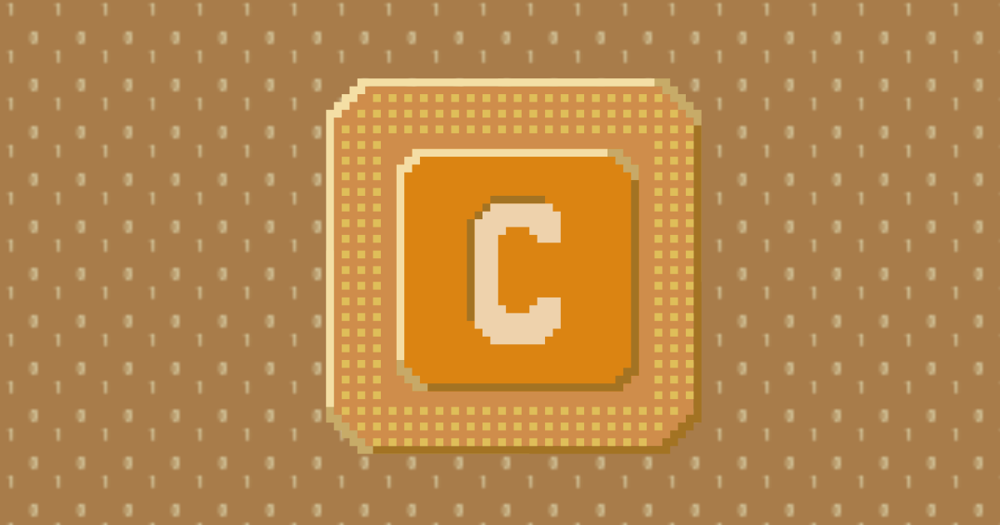

# ChipDefense: Copper

**ChipDefense: Copper** is a fork of **ChipDefense** (originally created by **Oliver Chadenas**) and is released under the **MIT License**.

This game is a casual Android tower defense game based on electric circuits and logic chips, evoking the feel of classic 8-bit micro-processors.

Attackers are represented as bits and bytes. The player defends the CPU by building chips in designated slots. These “towers” deal damage using operations such as subtraction, right shift, bitwise AND, etc. Chips can be upgraded to become stronger.

The game also features “heroes of the information age”: historical figures that had major influence on the development of modern computing. Each hero provides a short biography and global bonuses that make gameplay easier.

---

## • Screenshots

| Select Level | Settings | About |
| - | - | - |
|  |  |  |

---

## Downlaod

Get the latest APK from the [Releases page](https://github.com/jmiguelrivas/chip-defense-copper/releases)